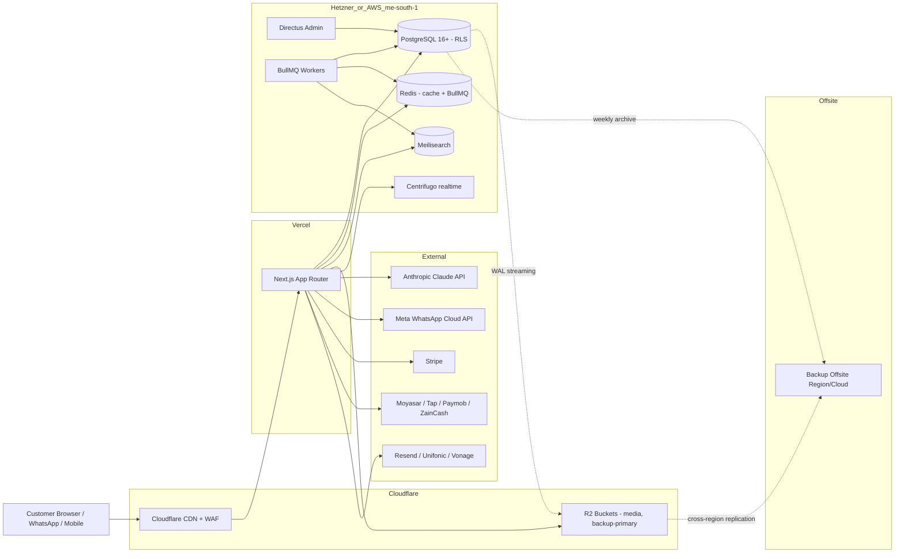

# Environment Topology

**Status:** Draft
**Owner:** Infra lead
**Last updated:** 2026-05-07 (domain root confirmed)

---

## Environments

| Env | Purpose | Hosting | Secrets source | Public DNS |
|---|---|---|---|---|
| `local` | Developer workstations | Docker Compose | `.env.local` (gitignored) | localhost |
| `dev` | Shared dev playground | **Hetzner Frankfurt** small CX22 | 1Password `vtc-dev` vault | `dev.ladders.vtc-me.com` |
| `staging` | Pre-prod validation, restore-test target | **Hetzner Frankfurt** | 1Password `vtc-staging` vault | `staging.ladders.vtc-me.com` |
| `production` | Live customer environment | Vercel (frontend) + **Hetzner Frankfurt** (backend services) | 1Password production vaults (per ADR-022) | `ladders.vtc-me.com` |

> **Domain root confirmed:** `ladders.vtc-me.com` (decision recorded 2026-05-07). This is the primary website domain across all locales (`/ar-sa`, `/en-sa`, etc.). Subdomains: `dev.*` and `staging.*` for non-production environments.

### Short-link / tracking domain (future, optional)

`tl.vtc-me.com` is reserved as a **possible future** short tracking/redirect domain for marketer referral and QR links (`/r/[code]`, `/qr/[code]`). It is **not** the primary website domain and is **not active in Phase 0/1**. Decision to activate deferred to Phase 5–6 when the marketer system ships.

---

## Topology diagram

---

## Network and DNS

- **DNS provider:** Cloudflare (ADR-014).
- **TLS:** Cloudflare-managed certs (Universal SSL + ACM where applicable).
- **WAF rules:** TODO — baseline OWASP Top 10 + custom rules for /admin paths (allow-list IPs from office/VPN if applicable).
- **DDoS protection:** Cloudflare baseline; upgrade to Pro/Business based on traffic volume.

---

## Region rationale

| Region | Status | Why |
|---|---|---|
| **Frankfurt (Hetzner)** | 🟢 **Phase 1 active (D-INFRA-001 Answered 2026-05-07; ADR-018 ✅ Accepted)** | Lowest-cost EU hosting; great Docker fit; operational simplicity; good MENA latency via Cloudflare PoPs; appropriate for MVP cost discipline |
| Bahrain (AWS me-south-1) | 🔵 Future migration option | Closest AWS region to KSA/Egypt/Iraq; ZATCA in-region preference; reserved for future migration if compliance / latency / enterprise tier demands it (see ADR-018 §"Future migration") |
| Cloudflare global | 🟢 Active | Edge cache + DDoS + Image Resizing absorbs end-user latency to MENA |

> 🟢 **Decision (2026-05-07):** Phase 1 backend hosts on Hetzner Frankfurt. Production secrets sourced via `op` CLI from 1Password (ADR-022) — no plaintext secrets on disk. Backups go to Cloudflare R2 primary + Backblaze B2 offsite (ADR-023). AWS me-south-1 migration plan documented in ADR-018 §"Future migration to AWS me-south-1"; not Phase 1 scope.

---

## Secrets storage

**Never** stored in:
- Application code
- Git
- Backups (R2 primary or B2 offsite)
- Logs
- CI environment variables (other than the 1Password service-account bootstrap token, which is itself rotated quarterly)

**🟢 Stored in: 1Password Secrets Automation** (ADR-022, ✅ Accepted 2026-05-07; D-BKP-001 🟢 Answered). Six production vaults: `vtc-prod-payment` · `vtc-prod-whatsapp` · `vtc-prod-ai` · `vtc-prod-infra` · `vtc-prod-backup-keys`, plus `vtc-staging` and `vtc-dev` (test-mode keys only). Application reads via `op` CLI at boot using `op://...` references. See `08-backups/05-secrets-exclusion-policy.md` and ADR-022 for full vault structure.

Excluded from all backups (see `08-backups/05-secrets-exclusion-policy.md`).

## Backup storage

**🟢 Locked 2026-05-07 (ADR-023, D-BKP-002 Answered):**

- **Primary:** Cloudflare R2 (zero egress; same control plane as media storage per ADR-013).
- **Offsite:** Backblaze B2 (different cloud → reduces correlated-failure risk; cheap cold storage; S3-compatible).
- **Replication:** R2 → B2 via scheduled BullMQ worker (weekly archives + on-demand for 7y archives).
- **Encryption:** AES-256 at rest with `BACKUP_ENCRYPTION_KEY` from `vtc-prod-backup-keys` 1Password vault (split-knowledge escrow between Guardian A + Guardian B).

See `08-backups/01-backup-types.md` for the full bucket layout and ADR-023 for the decision rationale.

---

## Staging Safety Rules (🟢 Locked 2026-05-07 — Strategic Enhancements 2026-05-07)

Staging environment must enforce these rules at all times:

| Rule | Enforcement |
|---|---|
| **`<meta name="robots" content="noindex,nofollow">`** | Every staging page; CI test asserts header present |
| **`/robots.txt` disallows all** | `User-agent: *` + `Disallow: /` |
| **Canonical URLs do NOT reference staging** | Canonicals point to `ladders.vtc-me.com` only on production; staging serves no canonical (or self-staging-canonical with `noindex`) |
| **Basic Auth or IP restriction** | Cloudflare Access policy; office + VPN + named developer IPs only |
| **No production payment credentials** | Staging uses payment provider sandbox keys exclusively (Stripe test mode, Moyasar test, Tap test, Tabby/Tamara sandbox, Paymob test, ZainCash test) |
| **No production WhatsApp tokens** | Staging WhatsApp uses Meta Cloud API test number + test-mode templates |
| **No production AI keys with prod budget** | Staging Anthropic key has separate cost cap; runaway AI usage on staging cannot drain production AI budget |
| **No real customer data unless approved** | Staging seeds use synthetic data (`Faker` library); real customer data only for explicit support-replay session, must be redacted/anonymized post-session, audit logged |
| **No production analytics pixels** | Meta Pixel, TikTok, Google Ads, GTM, Snap, LinkedIn — all use staging-only test pixel IDs (separate from production); CI grep test rejects production pixel IDs in staging build artifacts |
| **No production webhooks fire from staging** | Outbound webhooks from staging blocked at egress firewall (or use staging-only webhook receivers); inbound webhooks rejected unless from sandbox provider IPs |
| **Staging watermark on every page** | Yellow banner top-of-page reading "STAGING ENVIRONMENT — NOT FOR REAL CUSTOMERS" in customer locale; banner styling can't be hidden by CSS bypasses |
| **No production secrets in env / 1Password vault references** | Staging uses `vtc-staging` 1Password vault exclusively; CI grep test rejects any reference to `vtc-prod-*` vaults in staging branch |
| **Production data restore-tests use isolated staging clone** | When restore-test runs (per ADR-023 backup verification), data lands in isolated `staging-restore-test` schema, not the active staging DB; auto-cleared after test |
| **Staging email goes to MailHog / sink, not real customers** | All transactional email routed to staging-only mailbox; real-customer email addresses replaced with `<original>@staging.vtc-me.invalid` at send time |
| **Staging SMS suppressed entirely** | No SMS sent from staging; provider configured with no live API key |

CI pipeline asserts these rules pre-deploy:
- HTML response on staging contains `noindex` meta tag.
- `/robots.txt` returns `Disallow: /`.
- No `secrets/vtc-prod-*` references in staging build.
- Staging pixel IDs differ from production.
- Staging watermark CSS class present on every page.

Violation of any rule blocks the staging deploy.

## Open questions

- ✅ **Answered 2026-05-07 (D-INFRA-001 / ADR-018):** Hetzner Frankfurt for Phase 1 backend; AWS me-south-1 reserved as future migration option.
- TODO: Production VPN / IP allow-list for admin panel.
- TODO: WAF rule set base.
- TODO: Cloudflare plan tier (Free vs Pro vs Business).
- ✅ **Answered (2026-05-07):** Primary domain root = `ladders.vtc-me.com`. `tl.vtc-me.com` reserved as optional future short-link domain.
- TODO: Confirm DNS records and Cloudflare zone setup for `ladders.vtc-me.com` complete.
- TODO: Decide whether `tl.vtc-me.com` is activated in Phase 5/6 (marketer launch) or deferred further.

---

## References

- ADR-013 (Cloudflare R2)
- ADR-014 (Cloudflare CDN)
- ADR-018 (Hosting backend)
- ADR-022 (Secrets manager)
- ADR-023 (Backup destination)
