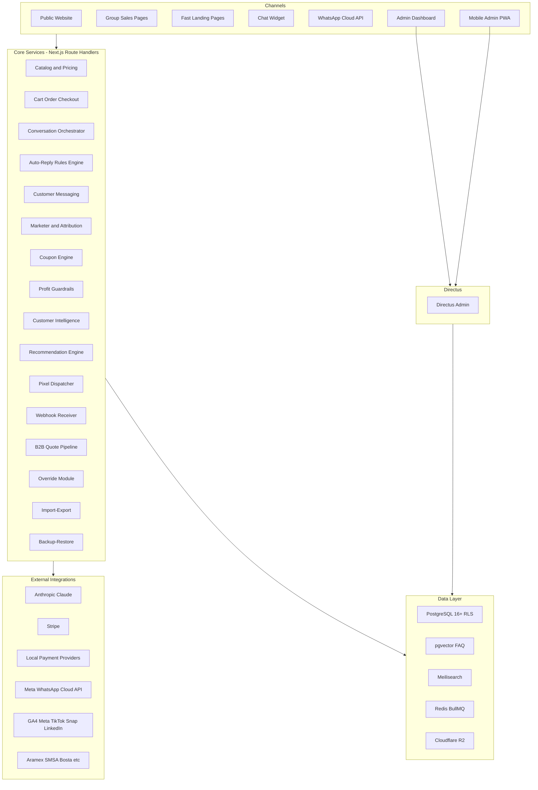

# Architecture Overview

**Status:** Draft
**Owner:** CTO
**Last updated:** 2026-05-07
**Source:** Final Master Plan v4 §2, §5

---

## System purpose

Smart Ladders Commerce Platform is **not a normal ecommerce store**. It is a multi-surface smart commerce system combining:

- Public ecommerce + group sales pages + fast landing pages
- AI sales assistant on web + WhatsApp
- Auto-reply rules engine
- Customer messaging & retention (lifecycle templates, broadcasts)
- Marketer/affiliate system with three-layer cost model
- Multi-gateway payments including Stripe
- B2B quotations
- Multi-warehouse operations
- Maintenance/warranty/service tickets
- Reporting & business intelligence (16 dashboards)
- Public REST API + webhooks
- Admin dashboard with strict RBAC + RLS for cost privacy

## Architectural pillars

### 1. Per-country dynamism
Zero hardcoded country columns. Adding a 4th country = INSERT row in `country` + populate junction tables. **No code or schema migrations.**

### 2. Three-layer cost model with RLS
```
actual_product_cost   [super_admin + finance only — RLS enforced]
marketer_product_cost [super_admin + finance + marketing_manager + that marketer]
selling_price         [everyone]
```
All financial values **snapshotted on order creation** so historical reporting remains stable when costs change.

### 3. AI does language; tools do facts
Catalog/price/stock/policy never appear in LLM prompt. They are fetched live via tools each turn. AI cannot fabricate what it never had.

### 4. Provider abstractions
Every external dependency (LLM, payment gateway, courier, SMS, push) sits behind an internal interface so vendor swaps are flag-driven, not rewrites.

### 5. Override-with-reason
Every safeguard bypass becomes a reasoned, audited, time-bounded, reportable event. Not a hidden flag.

### 6. Backup before risky change
Pre-risky-change automatic snapshots block the action until backup completes + verifies checksum.

---

## High-level system diagram



---

## Component responsibilities

| Component | Responsibility |
|---|---|
| **Next.js (App Router) frontend + Route Handlers** | All customer-facing rendering + customer API |
| **Directus** | Admin UI, schema-introspected from Postgres, with custom extensions for landing builder, override approver, import/export |
| **PostgreSQL with RLS** | System of record. RLS isolates cost columns. JSONB for variant attrs. `pg_trgm` Arabic FTS fallback |
| **pgvector** | FAQ/policy embedding store, queried by AI agent's `get_faq` tool |
| **Meilisearch** | Customer-facing product search (Arabic morphology aware) |
| **Redis + BullMQ** | Reply rules cache, AI cache, message dispatch queue, abandoned-cart timer, reservation TTL release, scheduled backups |
| **Centrifugo** | Realtime pub/sub for chat widget + admin live inbox |
| **Anthropic Claude (Sonnet + Haiku)** | Default LLM. Provider-abstracted; OpenAI/Gemini/local pluggable per task |
| **Cloudflare R2 + CDN** | Media storage + edge delivery + image resizing |
| **WhatsApp Business Cloud API** | Inbound webhooks + outbound dispatch (templates + free-form within 24h window) |
| **Stripe (+ local providers)** | Payment processing via `PaymentProvider` abstraction |
| **Sentry + Grafana + Loki** | Errors, logs, metrics |

---

## Hosting topology

See `environment-topology.md` for diagram.

| Service | Where it runs |
|---|---|
| Frontend (Next.js) | Vercel (or self-hosted on Hetzner/AWS me-south-1) |
| Backend services + Directus + Postgres + Redis + Meilisearch + Centrifugo | Hetzner / AWS me-south-1 |
| Static media | Cloudflare R2 |
| CDN + WAF | Cloudflare |
| LLM | Anthropic API (provider-abstracted) |
| WhatsApp | Meta Cloud API |
| Backup storage | R2 primary + offsite (different region/cloud) |

---

## Non-functional targets

- **LCP** <2s on 4G
- **INP** <200ms
- **CLS** <0.05
- **Lighthouse mobile** ≥90 on customer-facing routes
- **Lighthouse mobile** ≥85 on mobile-mandated admin surfaces
- **API p95** <300ms for cached read paths
- **Search p95** <100ms (Meilisearch)
- **Recovery point objective (RPO)** ≤1 hour
- **Recovery time objective (RTO)** ≤4 hours critical, ≤24 hours non-critical
- **Backup retention** 90d operational, 7y financial archive
- **Token budget** TODO: confirmed monthly cap

---

## Open architectural questions

- TODO: hosting tier — Vercel Pro vs self-hosted vs hybrid
- TODO: secrets manager choice (1Password / Doppler / AWS Secrets Manager)
- TODO: backup offsite destination
- TODO: LLM monthly budget cap

See [stack-decisions.md](stack-decisions.md) for the full decision checklist.

---

## References

- Master Plan v4 §2, §3, §5
- ADRs in `adr/`
- Database schema: `01-database/02-tables-by-module.md`
