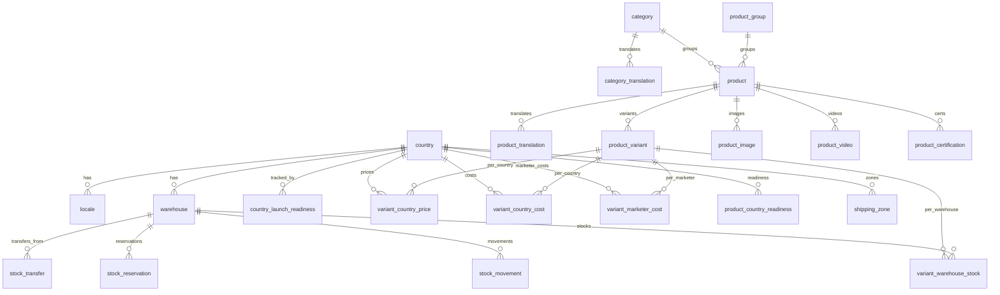
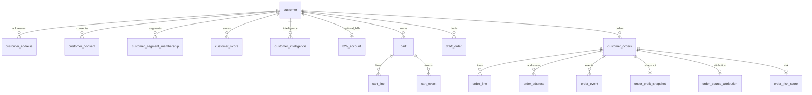
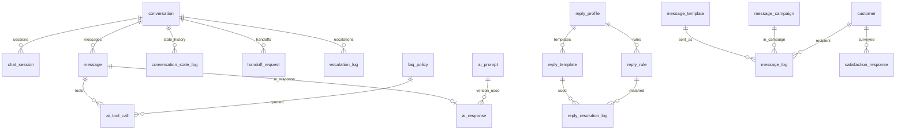
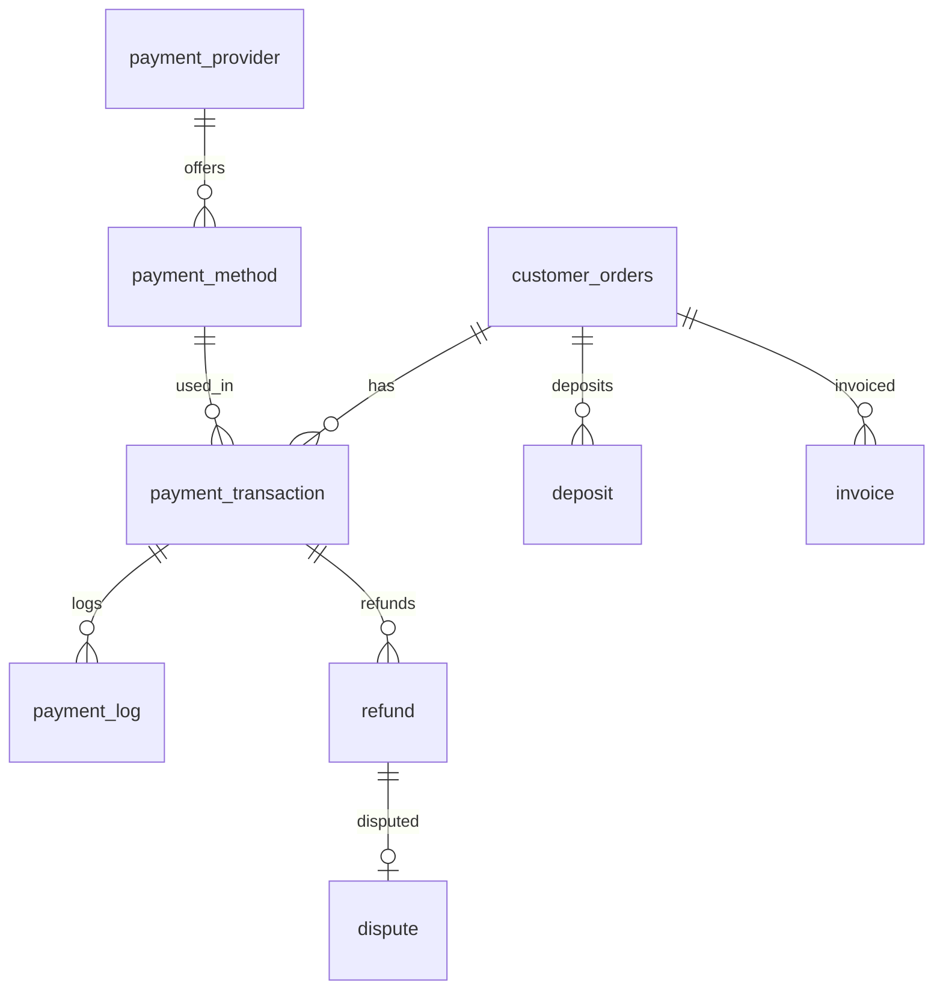
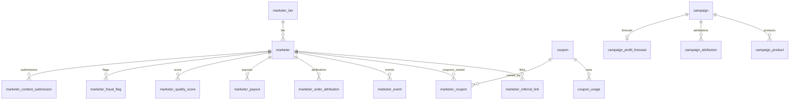
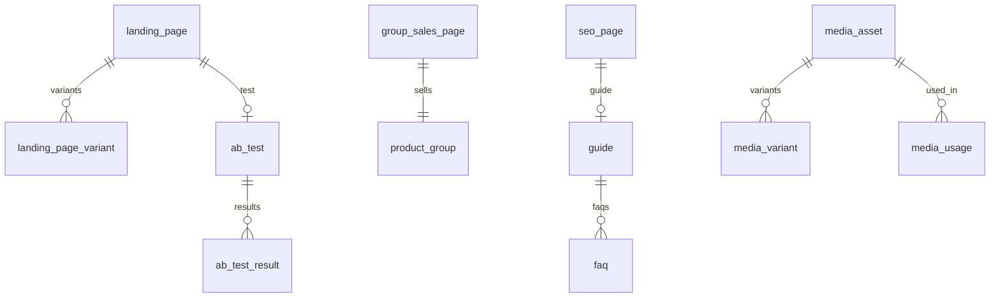
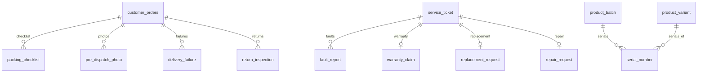
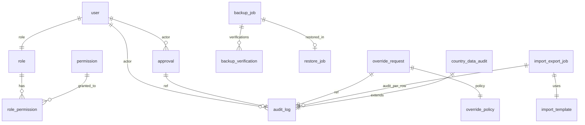

# Entity Relationship Diagram

**Status:** Draft
**Owner:** DBA
**Last updated:** 2026-05-09

This file shows high-level entity relationships in Mermaid format. For full table specs, see `02-tables-by-module.md`.

The full ERD is split into **module clusters** because rendering 70+ entities in one diagram is unreadable.

> 🟢 **Modules 24–27 ERD expansion deferred to Phase 6 (locked 2026-05-09).** Modules 24 (Decision & Recommendation Engine), 25 (Safety & Compliance), 26 (Trust Layer), and 27 (Readiness Engine) currently have **Phase 1 schema reservations / planning docs only** in `02-tables-by-module.md`. Full ERD cluster diagrams for these modules are deferred to the **Phase 6 design window**, unless any Module 24–27 table becomes active earlier (in which case ERD detail follows the activation). **Phase 1 should not be blocked by full ERD detail for these future modules.** Existing ERD clusters (1–8) cover the active Phase 1 schema and remain authoritative.

---

## Cluster 1 — Geo / Catalog / Pricing / Stock



## Cluster 2 — Customer / Cart / Customer Orders

> 🟢 D-DB-001 Answered 2026-05-07: main orders table is `customer_orders` (plural). Child tables `order_line`, `order_event`, etc. retain `order_*` prefix per `02-tables-by-module.md` Module 6 naming-convention callout.




## Cluster 3 — AI / Conversation / Auto-Reply / Messaging



## Cluster 4 — Payments



## Cluster 5 — Marketers / Coupons / Campaigns



## Cluster 6 — Landing / SEO / Media



## Cluster 7 — Operations / Maintenance



## Cluster 8 — System / Audit / Override / Backup / Import



---

## Source files

ERD source files (DBML and Mermaid) live in `01-database/erd-source/` (TODO: create as Phase 0 work proceeds).

```
erd-source/
  schema.dbml         (full DBML — preferred for dbdiagram.io)
  schema.mermaid      (full Mermaid — embedded above per cluster)
  cluster-1-catalog.mermaid
  cluster-2-orders.mermaid
  ...
```

---

## TODO

- TODO: produce full `schema.dbml` and `schema.mermaid` files.
- TODO: render PNGs of each cluster for inclusion in design reviews.
- TODO: add foreign-key cardinality annotations after schema review.
