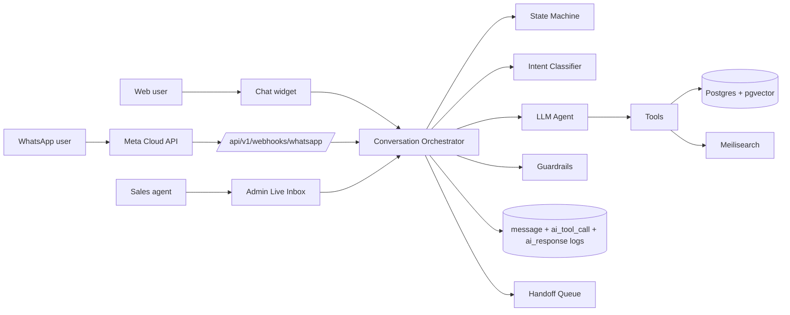

# AI Sales Assistant — Architecture Overview

**Status:** Draft
**Owner:** AI lead
**Last updated:** 2026-05-07
**Source:** Final Master Plan v4 §9

---

## Design principle

**The LLM does language and judgment; tools do facts.** Catalog/price/stock/policy data is NEVER prompted in. Every factual claim comes from a tool call. The agent cannot fabricate what it never had.

---

## Pipeline

```
Channel adapter (Web · WhatsApp · Admin · IG-future)
    ↓
Conversation Orchestrator
    ├── State Machine (deterministic)         ── 02-state-machine.md
    ├── Intent Classifier (Haiku, cheap)
    ├── LLM Agent (Sonnet) + Tools            ── 03-tools.md
    └── Guardrails                            ── 05-guardrails.md
        ├── Topic filter
        ├── Output validator
        ├── PII redactor
        └── Prompt-injection defenses
    ↓
Reply dispatch back to channel
    ↓
Logging (message + tool + state + confidence + tokens)  ── 12-logging-and-audit.md
```

## Components

| Component | Responsibility | Implemented in |
|---|---|---|
| Channel adapters | Normalize incoming messages from web / WhatsApp / admin / IG into canonical envelope | Phase 3 (web), Phase 4 (WhatsApp), Phase 10 (IG) |
| State machine | Track conversation funnel (16 states); guard transitions | Phase 3 |
| Intent classifier | Cheap first-pass labeling (Haiku or rule-based) | Phase 3 |
| LLM agent | Sonnet for reasoning + tool use + structured output | Phase 3 |
| Tools | Provide live catalog/price/stock/policy data | Phase 3 |
| Guardrails | Topic restriction, output validation, PII redaction, prompt injection | Phase 3 |
| Confidence scorer | Self-reported + signal-adjusted; drives handoff | Phase 3 |
| Cache | Common-Q&A redis cache (intent + country + locale + normalized query) | Phase 3 |
| Provider abstraction | `LLMProvider` interface — Anthropic default, OpenAI ready | Phase 3 |
| Handoff queue | Routes low-confidence/escalated conversations to human agents | Phase 3 |
| Conversation logger | Full transcript + tool calls + state + confidence + tokens | Phase 3 |

## Channel topology



## Data flow per turn

1. Inbound message arrives via channel adapter.
2. Conversation loaded (or created) by `(channel_thread_id, customer phone or guest token)`.
3. Auto-Reply rules engine resolves rule (see `04-ai/05-guardrails.md` and Master Plan v4 §10):
   - If "Template only" → render template, send, log, end.
   - If "AI" mode → continue.
4. Intent classifier labels intent (Haiku or rules).
5. State machine determines applicable state.
6. LLM agent invoked with state-specific system prompt + customer message + available tools.
7. Agent invokes tools (e.g., `search_products`, `recommend`, `get_shipping`).
8. Agent returns structured output: `{reply_text, state_transition, confidence, citations, needs_human}`.
9. Output validator checks for forbidden claims; PII redactor produces `text_redacted` for analytics.
10. Reply dispatched on channel.
11. State persisted; logs written; if confidence < threshold OR explicit handoff signal → push to `handoff_request` queue.

## Provider routing (initial)

| Task | Default model |
|---|---|
| Intent classification | Haiku |
| FAQ re-ranking | Haiku |
| Sales reasoning / recommendation | Sonnet |
| Order summary | Sonnet |
| Handoff brief | Haiku |
| Auto-reply AI fallback | Sonnet |

Routing config-driven; retunable in production based on quality + cost telemetry.

## Cost budgeting

See `10-cost-budgeting.md`. Per-conversation token cap; daily spend dashboard; alert on anomaly.

## Inventory awareness

See `08-inventory-aware-rules.md`. AI agent must call `check_stock_availability` before recommending; never promises out-of-stock SKUs.

## TODO

- TODO: confirm widget realtime transport (WebSocket vs SSE).
- TODO: confirm token budget cap per conversation.
- TODO: confirm intent classifier — pure LLM or rule-based first pass.
- TODO: confirm Sonnet 4.6 vs alternative if pricing changes.
- TODO: define handoff SLA (seconds during business hours).

## References

- Master Plan v4 §9, §10, §11
- ADR-011 (LLM default), ADR-012 (LLM abstraction)
- `02-state-machine.md`, `03-tools.md`, `05-guardrails.md`
