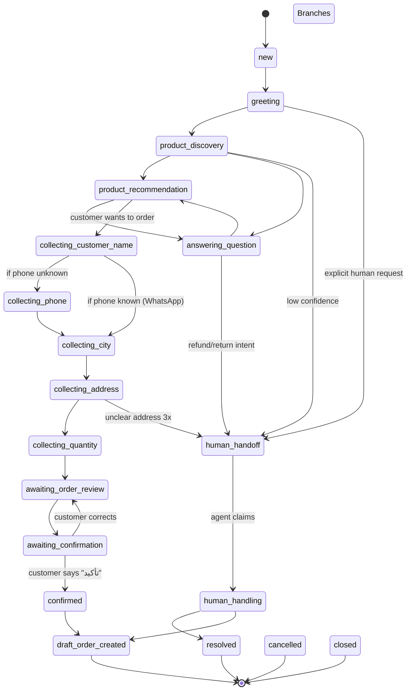

# Conversation State Machine

**Status:** Draft
**Owner:** AI lead

---

## States

```
new
greeting
product_discovery
product_recommendation
answering_question
collecting_customer_name
collecting_phone
collecting_city
collecting_address
collecting_quantity
awaiting_order_review
awaiting_confirmation
confirmed
draft_order_created
human_handoff
human_handling
resolved
cancelled
closed
```

## Transition diagram



## Guards

Transitions are gated by:
- Required fields populated (e.g., to enter `awaiting_order_review`, all customer fields and product selection must exist).
- Stock availability (cannot proceed past `product_recommendation` if `qty_available_total = 0` for the chosen variant — must suggest alternative).
- Guardrails (cost-leak attempts route to human).

## Persistence

State stored on `conversation.current_state`; transitions logged in `conversation_state_log`. State is recoverable across sessions and channels (web ↔ WhatsApp).

## Order capture sub-state machine

Within ORDER_CAPTURE (`collecting_*` states):

```
ASK_NAME → ASK_PHONE → CONFIRM_COUNTRY → ASK_CITY → ASK_ADDRESS → ASK_QTY → ASK_PAYMENT → REVIEW
```

Skips already-known fields if customer is recognized from prior order.
Each sub-state has validators (phone format per country, address required fields, etc.).

## Correction transitions

Customer correcting an earlier answer:
1. Customer types correction (e.g., "actually, address should be ...").
2. Detected by intent classifier as "correction".
3. State machine moves to relevant sub-state (e.g., back to `collecting_address`).
4. After correction, returns to where it was (e.g., `awaiting_order_review`).

## Mid-flow off-topic

Customer asking unrelated question mid-capture:
1. Detected by intent classifier as "FAQ" or "policy_question".
2. AI answers via FAQ tool, then prompts to continue capture.
3. State unchanged.

## TODO

- TODO: precise rule for when phone is "known" (recent WhatsApp session, prior order, manually verified).
- TODO: handle language switch mid-conversation (customer types in EN, then AR).
- TODO: define "draft_order_created" → "confirmed_order" transition (after admin confirmation).
